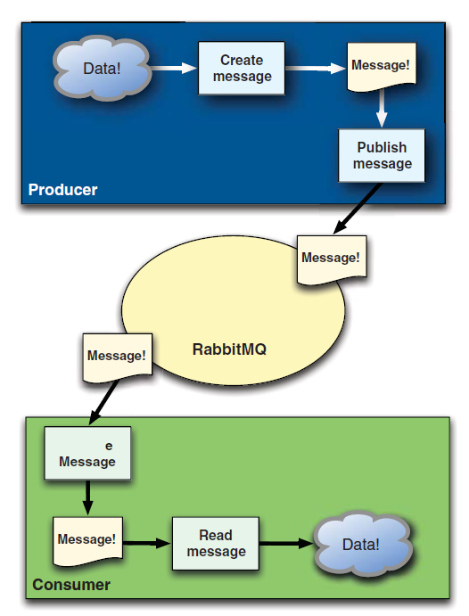
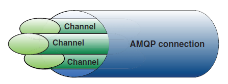
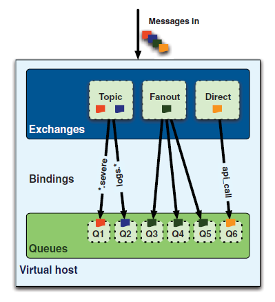

# 消息

### 中间人(Broker)

RabbitMQ充当中间人的角色，从生产者接收消息并转发给消费者。

### 消息(Message)

消息由两部分组成：有效负载(payload)和标签(label)。有效负载就是要传输的数据，数据可以为任意格式，包括二进制。标签描述有效负载，RabbitMQ通过标签决定将消息发给哪个消费者。

### 生产者(Producers)

产生(create)消息并发送(publish)给中间人。通信过程是发后即忘(fire-and-forget)和单向的(one-directional)。

### 消费者(Consumers)

连接到中间人并订阅(subscribe)一个队列。当消息到达队列时，RabbitMQ将它发送给订阅这个队列的消费者。消费者接收到的消息只有有效负载，标签在进行路由的时候被移除。消息从生产者到消费者的流程如图所示：

### 通道(Channels)

生产者和消费者需要通过通道连接到RabbitMQ，通道是在TCP连接内的一个虚拟连接(Virtual Connection)。由于建立和销毁TCP连接的代价很高，所以多个通道共用一个TCP连接，每个通道有一个唯一的ID标识。通道如图所示：

### 交换机(Exchanges)

交换机是生产者发送的消息的地方。

### 队列(Queues)

队列是消息到达并被消费者接收的地方。

### 绑定(Bindings)

绑定决定消息路由从生产者发送到特定的消费者。消息从交换机到队列的过程如图所示：

#### 交换方式(Exchange Type)

RabbitMQ常用的交换方式有fanout、direct、topic、headers四种。
